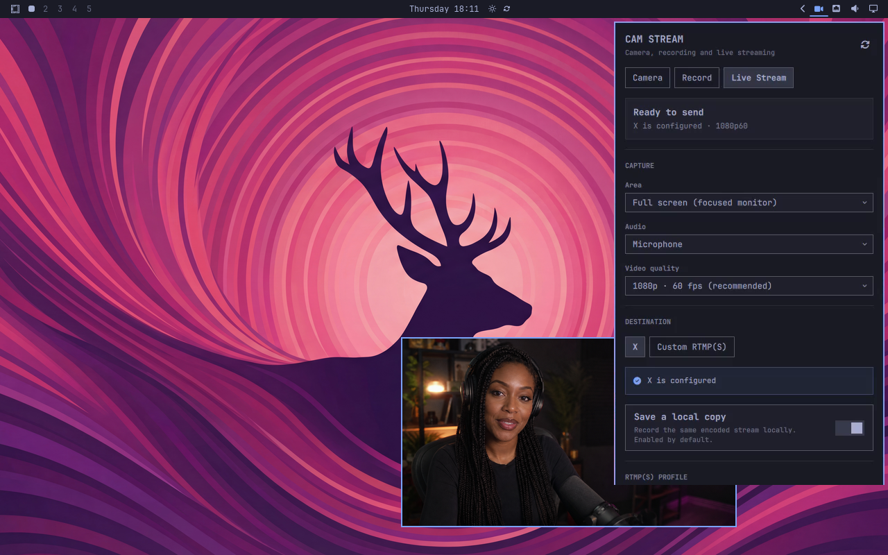

# Cam Stream

<p align="center">
  <strong>Stream the Omarchy desktop you already use.</strong><br>
  Your camera is a normal movable, resizable window—not a fixed OBS overlay.<br>
  Capture a focused monitor, window, or region; record it or send it live.
</p>

<p align="center">
  
</p>

<p align="center">
  <a href="#install"><strong>Install the Quattro plugin</strong></a>
  ·
  <a href="https://aur.archlinux.org/packages/cam-stream"><strong>Get the standalone AUR command</strong></a>
  ·
  <a href="LICENSE"><strong>MIT licensed</strong></a>
</p>

## Omarchy is the scene

Cam Stream turns the desktop itself into the streaming layout. Instead of
rebuilding your windows inside a fixed OBS canvas, arrange Omarchy exactly as
you want viewers to see it and capture that. The camera preview behaves like
any other Omarchy window: move it, resize it, tile it, float it, or hide it
while the stream is running. Its video fills the window as the layout changes.

| Camera | Record | Live Stream |
| --- | --- | --- |
| Low-latency V4L2 preview with realtime and smoother modes, camera selection, and mirroring. | Capture the focused monitor, a picked window, or a freeform region with your chosen audio and quality; pause, resume, and save to MP4. | Send the same capture to X Live Studio or a custom RTMP(S) endpoint; keys stay in the desktop keyring and a local copy is enabled by default. |

The camera and capture activity deliberately keep separate state. Starting or
stopping a recording or live send never changes the camera window, so the
layout on screen stays under your control. Full screen is the default capture
mode; the familiar Omarchy window and region pickers are also available, and
Cam Stream remembers the last choice.

Cam Stream lives in the Omarchy bar. Left click toggles the camera. Right click
opens the themed Camera, Record, and Live Stream controls, with distinct states
for previewing, recording, sending, stopped, error, and no-camera conditions.

## Install

### Omarchy 4 / Quattro plugin

Install the native bar widget and enable it immediately:

```bash
omarchy plugin add https://github.com/tomdavenport/cam-stream.git --enable
```

Already have Cam Stream in your bar? Skip `add` and update the existing
checkout instead:

```bash
omarchy plugin update io.github.tomdavenport.cam-stream
```

The updater deliberately shows the incoming diff and asks for confirmation
before it changes anything. Confirm the prompt after reviewing it, or append
`--yes` when you have already reviewed and trust the release.

No AUR package is needed for the widget: the plugin includes its own helper.
Left click the new icon to toggle the camera, or right click it for Camera,
Record, and Live Stream controls.

### Arch Linux / AUR command

Install the standalone command without the Quattro widget:

```bash
yay -S cam-stream
```

This installs `cam-stream` at `/usr/bin/cam-stream`. It provides the camera,
recording, and RTMP(S) commands on Arch and other compatible Wayland desktops,
but it does not add the native Omarchy bar control.

## Omarchy plugin gallery

Cam Stream is live in the project-recommended community gallery. Open the
[Cam Stream marketplace listing](https://omarchyplugins.com/plugin.html?id=io.github.tomdavenport.cam-stream)
to review it or copy the install command. Its
[submission issue](https://github.com/HANCORE-linux/omarchy-plugin-marketplace/issues/129)
passed automated Quattro validation and maintainer review; the marketplace
periodically revalidates the current `main` branch for later versions,
description changes, and preview updates.

Plugin authors can submit another public Quattro plugin by following the
marketplace's [submission guide](https://github.com/HANCORE-linux/omarchy-plugin-marketplace/blob/main/SUBMISSION.md).

## Requirements

The native bar widget requires **Omarchy 4 (Quattro)** and its
Quickshell-based shell and plugin commands. It is not a Waybar module and does
not support Omarchy 3.

The bundled `cam-stream` command also works on its own on Arch Linux and other
Wayland desktops with V4L2 camera support. Standalone use does not require
Omarchy, but it does not install the bar widget.

Runtime dependencies:

- Bash 5
- `mpv`
- `v4l-utils` (`v4l2-ctl`)
- `util-linux` (`flock`)
- the coreutils and procps tools included in the Omarchy base system

Recording and live streaming additionally use:

- `gpu-screen-recorder` with per-instance IPC support
- `ffmpeg` to finish live local copies as MP4 files
- `libsecret` (`secret-tool`) and an unlocked Secret Service keyring for stream
  keys

These components ship with Omarchy 4. On standalone Arch installations they
are optional until Record or Live Stream is used.

`hyprctl` and `jq` are optional for best-effort Quattro window positioning;
the preview still works without automatic positioning. `fuser` from `psmisc`
is optional for reporting which process has a busy camera.

Install any missing packages through Omarchy's standard package workflow before
enabling the plugin. Add `psmisc` if you want busy-camera process reporting.
Omarchy already ships `hyprctl` as part of its desktop.

## Standalone AUR details

The [`cam-stream` AUR package](https://aur.archlinux.org/packages/cam-stream)
builds the latest stable release and installs the command at
`/usr/bin/cam-stream`. Using the standard manual AUR workflow:

```bash
git clone https://aur.archlinux.org/cam-stream.git
cd cam-stream
makepkg -si
```

Then inspect the available cameras and start a preview:

```bash
cam-stream camera list
cam-stream doctor
cam-stream start
cam-stream stop
```

The AUR package is intentionally command-only. To add the native Quattro bar
control, use the Omarchy installation below; the plugin remains self-contained
and does not depend on the AUR package.

## Review-first Omarchy installation

Omarchy plugins are unsandboxed code. The review-first path is to add Cam
Stream, inspect the checkout, and then enable it:

```bash
omarchy plugin add https://github.com/tomdavenport/cam-stream.git
cd "$HOME/.config/omarchy/plugins/io.github.tomdavenport.cam-stream"
less manifest.json
less BarWidget.qml
less bin/cam-stream
omarchy plugin enable io.github.tomdavenport.cam-stream --section right
```

To add and enable it in one command after reviewing the repository online:

```bash
omarchy plugin add https://github.com/tomdavenport/cam-stream.git --enable
```

The manifest requests the right side of the bar by default. Omarchy's bar
settings can move it later.

## Use

- **Left click** the bar icon to start or stop the camera preview, including
  while recording or sending live.
- **Right click** to open the Camera, Record, and Live Stream panel.
- **Middle click** to refresh camera and runtime state.
- Press **R** while the panel has focus to refresh it.

### Camera

The selected camera, mirror preference, and latency preference persist in Cam
Stream's own XDG configuration directory. Changing the camera or playback mode
while the preview is live restarts that preview so the change takes effect.

**Realtime (no buffer)** is the default and follows mpv's low-latency V4L2
path. **Smoother (adds latency)** is an explicit opt-in for steadier frame
pacing. Automatic camera discovery pauses while the preview is live so the bar
never repeatedly probes the active capture device; status checks continue.

### Record

Choose **Full screen**, **Window**, or **Region**, select an audio source, and
press **Start recording**. Full screen records the focused monitor. Window and
Region open the Omarchy picker for that run. The capture mode is remembered;
specific windows and rectangles are deliberately not.

Recordings are written beneath the user's Videos directory. Recording does not
start or stop the camera, so the floating camera window appears only when the
user has chosen to show it. Pause, resume, and stop affect only Cam Stream's
owned recording process. The shared quality preset caps output resolution and
frame rate; recordings use GPU Screen Recorder's very-high quality mode.

### Live Stream

Cam Stream supports an **X** profile and a **Custom** RTMP(S) profile. X always
uses encrypted RTMPS; custom destinations may use RTMP, though RTMPS is strongly
recommended. Cam Stream does not sign in to X or publish on your behalf. It
sends to the RTMPS ingest that X Live Studio gives you; previewing, going public,
and ending the broadcast stay in X. To use it:

1. Open [X Live Studio](https://x.com/i/live-studio) and create or select a
   source.
2. Paste its `rtmps://` server URL and stream key into Cam Stream, then save.
3. Choose capture, audio, and quality settings and press **Start sending**.
4. Preview and publish the broadcast in X Live Studio.

Cam Stream says **Sending to X** rather than claiming the broadcast is already
public. Publishing and ending the X broadcast remain explicit actions in X.
Local recording is enabled by default and uses the same encode; after stopping,
Cam Stream remuxes that local copy to MP4 without re-encoding it.

Live presets use constant bitrates of 6 Mbps for 720p30, 8 Mbps for 1080p30,
and 12 Mbps for 1080p60.

Stream keys are stored in the desktop keyring, never in Cam Stream's config or
logs. Cam Stream fails closed when no usable Secret Service is available.

The bundled command also works directly:

```bash
cam_stream="$HOME/.config/omarchy/plugins/io.github.tomdavenport.cam-stream/bin/cam-stream"
"$cam_stream" status
"$cam_stream" camera list
"$cam_stream" start
"$cam_stream" stop
"$cam_stream" activity settings
"$cam_stream" record start
"$cam_stream" record stop
printf '%s' "$stream_key" | "$cam_stream" live configure x \
  --server 'rtmps://example.invalid/app' --key-stdin
"$cam_stream" live start x
"$cam_stream" live stop
```

Run `"$cam_stream" --help` for the complete command reference.

## Update

```bash
omarchy plugin update io.github.tomdavenport.cam-stream
```

Omarchy fetches the repository, shows the incoming diff for review, and only
accepts a fast-forward update that still passes plugin validation. The shell
rescans updated plugins automatically. If you have already reviewed the
release and do not need the interactive diff prompt, run:

```bash
omarchy plugin update io.github.tomdavenport.cam-stream --yes
```

## Disable or remove

Disable the widget without deleting its checkout:

```bash
omarchy plugin disable io.github.tomdavenport.cam-stream
```

Stop any recording or live send, then stop the camera preview before removing
the plugin, because those processes are separate from the shell:

```bash
cam_stream="$HOME/.config/omarchy/plugins/io.github.tomdavenport.cam-stream/bin/cam-stream"
"$cam_stream" live stop
"$cam_stream" record stop
"$cam_stream" stop
omarchy plugin remove io.github.tomdavenport.cam-stream
```

Removal deletes the git-managed plugin checkout. It intentionally leaves Cam
Stream's user preferences and diagnostic history in place.

### Remove residual data

After stopping the preview and removing the plugin, its residual data is
limited to its own XDG locations:

- `${XDG_CONFIG_HOME:-$HOME/.config}/cam-stream/config` — camera, capture,
  audio, quality, destination, and non-secret endpoint preferences, stored as
  plain data and never sourced as shell code
- `${XDG_STATE_HOME:-$HOME/.local/state}/cam-stream/` — the runtime log, PID,
  active-launch records, and last activity result
- `${XDG_RUNTIME_DIR}/cam-stream/` — transient locks and local mpv/GSR IPC files
  when `XDG_RUNTIME_DIR` is secure; otherwise Cam Stream uses an owner-only
  directory below `${TMPDIR:-/tmp}/cam-stream-runtime-$(id -u)/`

If you do not want to keep preferences or logs, those exact locations can be
deleted manually. This is optional and irreversible; do it only after the
preview is stopped.

## Security and trust

Omarchy loads plugins as unsandboxed code inside its long-lived shell. Review
this repository and every update before enabling it. A marketplace listing is
discovery metadata, not a security review or endorsement.

Cam Stream's preview and recording behavior is local. Live Stream deliberately
connects to the RTMP(S) destination the user configured:

- The QML widget launches only the `bin/cam-stream` file bundled in the plugin
  checkout.
- The helper reads local V4L2 camera devices, starts a local `mpv` preview, and
  can run one explicitly requested screen recording or RTMP(S) send.
- It requires no elevated privileges or system service.
- It writes runtime metadata only to its own XDG config, state, and runtime
  paths; recordings go to the user's Videos directory.
- Stream keys are passed to the helper over stdin and stored through Secret
  Service. They are excluded from config, logs, status, and normal output.

`gpu-screen-recorder` receives the destination while a stream is active, so the
current user's process-inspection tools may be able to see it at runtime. The
keyring protects credentials at rest; it cannot hide data from other processes
already running as the same user.

Installing and updating through `omarchy plugin` does use git and the network
to retrieve this public repository.

## Troubleshooting

Define the helper path once before running the checks below:

```bash
cam_stream="$HOME/.config/omarchy/plugins/io.github.tomdavenport.cam-stream/bin/cam-stream"
```

### The widget is missing

Confirm that Omarchy discovered and enabled it, then rescan if needed:

```bash
omarchy plugin list
omarchy-shell shell rescanPlugins
omarchy plugin enable io.github.tomdavenport.cam-stream --section right
```

Cam Stream requires the Quattro shell. A Waybar session cannot load
`BarWidget.qml`.

### No camera appears

```bash
"$cam_stream" camera list
"$cam_stream" camera diagnose
"$cam_stream" doctor
```

The panel offers video-capable or otherwise unclassified V4L2 nodes and
ignores nodes identified as metadata-only. Reconnect the camera, press **R**
in the panel, and check that your login session has read and write access to
the relevant `/dev/video*` device. Fix device access through the system's
udev/logind policy rather than making the device world-writable.

### The preview feels delayed

Switch back to the realtime path and inspect the mode Cam Stream actually
opened:

```bash
"$cam_stream" restart --untimed
"$cam_stream" status
```

`status` reports the active camera plus its capture format, size, and frame
rate. A camera opened at a low frame rate can feel delayed even when the player
is not buffering. If delay remains, send the `status` output and the final
`start camera=...` line from `"$cam_stream" logs 20`; those contain no image or
video data and make device-specific problems reproducible.

### The camera is busy

Only one application can open many camera devices at a time. Close video-call,
recording, or browser software using that input, then retry. When optional
`fuser` is installed, `camera list` and `camera diagnose` report detected users
of each device.

### The preview fails or immediately closes

```bash
"$cam_stream" status
"$cam_stream" logs 100
"$cam_stream" doctor
```

Check that `mpv` and `v4l2-ctl` are installed, then use the reported device and
format errors to choose a different camera in the panel. Cam Stream rotates its
own log when it grows; it does not collect Omarchy or application logs.

### A saved camera was unplugged

Cam Stream falls back to automatic camera selection when possible. Choose
another input in the panel to replace the saved preference.

## License

[MIT](LICENSE) © 2026 Tom Davenport.
